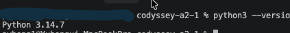
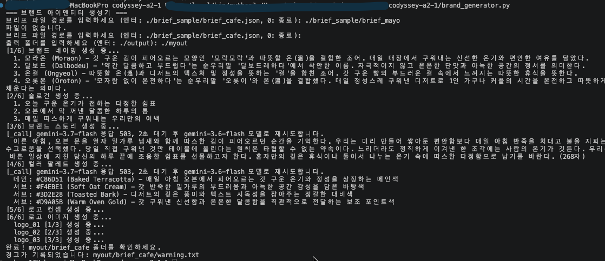
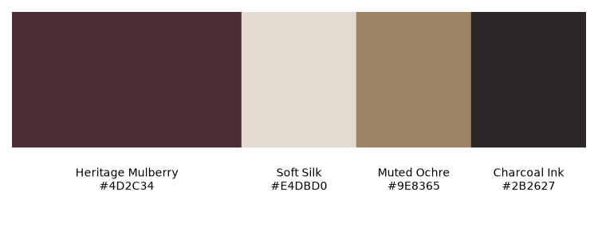
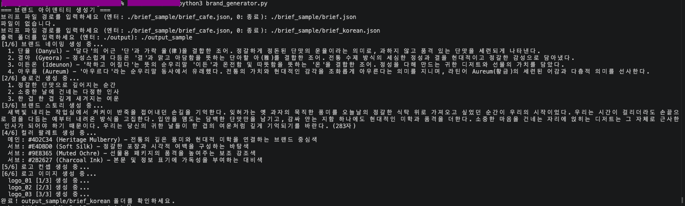
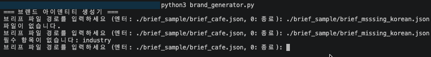
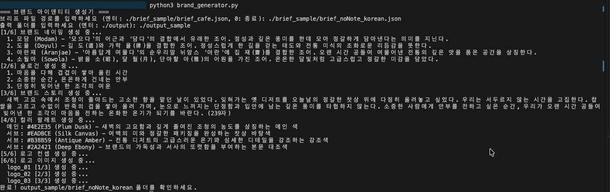
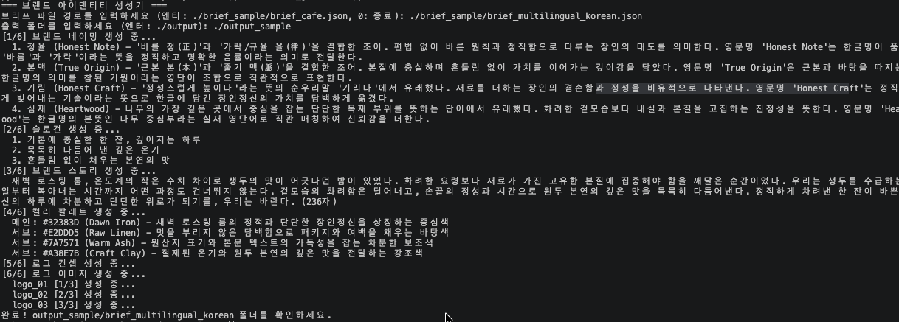
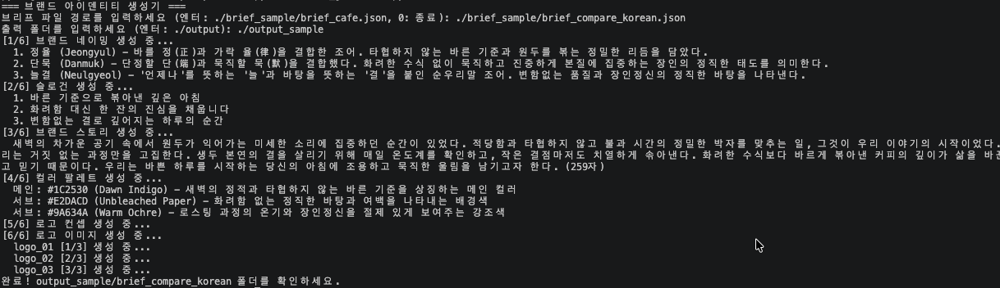

# codyssey-a2-1 — 브랜드 아이덴티티 생성기


브리프(JSON) 하나를 넣으면 브랜드 네이밍 · 슬로건 · 브랜드 스토리 · 컬러 팔레트 · 로고 시안까지 자동으로 생성하는 Python CLI 파이프라인입니다. 

---

## Gemini API 종속성 안내

이 프로젝트는 현재 **Google Gemini API에 종속**되어 있습니다. 텍스트와 이미지 호출은 모두 `gemini_provider.py`의 두 함수를 통해서만 이루어집니다.

```python
def generate_text(prompt: str) -> str
def generate_image(prompt: str) -> bytes
```

`brand_generator.py`를 비롯한 나머지 코드는 이 두 시그니처만 알 뿐, Gemini 고유의 요청/응답 형식은 모릅니다. `generate_text`가 dict가 아니라 str을 반환하는 것이 그 경계입니다 — 프로바이더가 응답 구조 차이를 흡수하고, JSON 파싱은 호출부가 합니다.

다른 서비스로 교체하려면 **같은 시그니처의 `generate_text` / `generate_image`를 제공하는 새 프로바이더 모듈**을 작성해 `gemini_provider` 자리에 꽂아 넣어야 합니다. 바꿔야 할 지점은 `gemini_provider.py` 상단 독스트링에 명시해 두었습니다.

```
다른 프로바이더로 교체할 때 바꿀 곳:
  _call()           URL 조립과 인증 헤더
  generate_text()   요청 바디, 응답에서 텍스트 추출
  generate_image()  요청 바디, 응답에서 이미지 바이트 추출
```

---


## AI 코딩 도구 활용
과제의 목표가 "AI를 활용한 개발"이었기 때문에, **어디까지 손으로 치고 어디부터 도구에 맡길지**를 먼저 정하고 시작했습니다.

**손으로 작성한 부분**은 파이프라인의 골격입니다. API 호출 계층(`gemini_provider.py`), 브리프 검증, 프롬프트 로딩, 그리고 스테이지 하나를 처음부터 끝까지 관통시키는 `run_stage()`. 이 넷이 나머지 전부의 원형이 되기 때문에, 여기서 구조가 흔들리면 뒤에서 복구할 수 없다고 판단했습니다.

**Claude Code에 위임한 부분**은 그 원형을 반복 적용하는 작업입니다. 나머지 4개 스테이지 확장, matplotlib 팔레트 렌더링, 대화형 입력, 재시도 로직, 최종 보고서 조립. 원형이 이미 있으니 "같은 구조로 복제해라"는 지시가 정확하게 적용됐습니다.

도구를 붙이기 전에 `CLAUDE.md`로 제약을 먼저 걸었습니다. 규칙 없이 맡기면 베이스 클래스와 레지스트리 패턴이 생겨나고, 그 순간 설명할 수 없는 코드가 됩니다. 전체 규칙은 [CLAUDE.md](./CLAUDE.md)에 있고, 아래는 그중 핵심만 발췌한 것입니다.

```markdown
# 규칙
- 새로운 추상화를 도입하지 않는다. 클래스, 데코레이터, 베이스 클래스를 만들지 않는다.
- 기존 함수의 구조와 시그니처를 그대로 따른다. 리팩터링하지 않는다.
- 프롬프트는 prompts/*.txt에서 읽는다. 코드에 하드코딩하지 않는다.
- API 호출은 gemini_provider의 generate_text / generate_image만 사용한다.
- 스테이지 실패 시 None을 반환하고 파이프라인은 다음 단계를 계속 진행한다.
- 파일 전체를 덮어쓰지 않는다. 항상 부분 편집한다.
- 코드를 대체할 때 기존 줄을 반드시 삭제한다.
```

덮어쓰기와 코드 대체에 관한 두 줄은 실제로 겪은 문제를 규칙으로 만든 것입니다. 전체 덮어쓰기가 파일을 망가뜨린 적이 있었고, 대체한 옛 코드가 지워지지 않고 아래에 새 코드만 추가되는 일이 반복됐습니다.

---

## 프롬프트 설계

### [프롬프트](./prompts)

이 프로그램의 결과물 품질은 사실상 프롬프트가 결정합니다. 코드는 프롬프트를 전달하고 응답을 검증하는 역할이고, "좋은 브랜드명이란 무엇인가"에 대한 판단은 전부 프롬프트 안에 있습니다.

프롬프트는 `prompts/` 폴더의 텍스트 파일 5개로 분리돼 있어 **코드를 수정하지 않고 프롬프트만 교체**할 수 있습니다. 자리표시자 `{{입력}}` 하나만 지키면 됩니다.

```python
def load_prompt(stage_name: str, payload: dict) -> str:
    template = Path(f"./prompts/{stage_name}.txt").read_text(encoding="utf-8")
    if "{{입력}}" not in template:
        raise ValueError(f"prompts/{stage_name}.txt에 {{{{입력}}}} 자리표시자가 없습니다")
    payload_text = json.dumps(payload, ensure_ascii=False, indent=2)
    return template.replace("{{입력}}", payload_text)
```

자리표시자 존재 여부를 먼저 확인합니다. 이게 없으면 브리프가 전달되지 않은 채로 **HTTP 200이 떨어지고**, 모델은 "입력이 없다"는 답을 정상 응답으로 돌려줍니다. 조용히 틀린 결과가 나오는 걸 막는 검사입니다.

### 창작 원칙

각 스테이지마다 지켜야 할 원칙을 먼저 정하고 프롬프트에 옮겼습니다. 네이밍의 경우:

```
[네이밍 원칙]
- 2~4음절, 받침이 적어 발음이 부드럽고 구어체로 말하기 쉬울 것
- 브랜드가 속한 업종·카테고리를 이름에 직접 지칭하지 말 것 (예: "디저트", "카페")
- 키워드나 컨셉 단어를 그대로 쓰지 말고 은유·조어로 치환할 것
- 경쟁사와 비슷한 어미·구조(예: "~당", "~랩", "~하우스" 같은 접미어 반복)를 피하고
  차별화된 조어 방식을 쓸 것
- 한글명과 영문 표기 모두 어색함 없이 발음되고, 다른 언어권에서 부정적 의미로 읽히지 않을 것
- 브랜드의 톤(고급/캐주얼/유쾌함 등)과 이름의 어감이 어긋나지 않을 것
```

원칙이 실제로 작동합니다. 한과 브리프(경쟁사: 성심당, 이성당)에서 나온 결과는 `~당` 접미사를 피한 "모담", "도율", "아란재", "소월아"였고, 모델이 스스로 그 이유를 설명합니다.

> 경쟁사들은 3음절 한자어에 전통적 상호 접미사인 '\~당(堂)'을 사용한 반면, 제안된 후보들은 '\~당' 형식을 피하고 받침이 적은 2~3음절의 감성적 조어를 활용해 현대적이면서도 고급스러운 어감을 선사한다.

다국어 규칙을 강화한 뒤에는 원두 로스터리 브리프에서 `심재 → Heartwood`가 나왔습니다. 심재(心材)와 heartwood는 실제로 같은 개념을 가리키는 단어로, 조어가 아니라 대응하는 실재 영단어를 찾아낸 사례입니다. 규칙을 고치기 전에는 `Authentia`, `Aurae` 같은 라틴어풍 조어가 나왔습니다.

### 조건부 처리

브리프의 선택 항목이 있을 때와 없을 때를 프롬프트가 직접 분기합니다. 판단 기준은 **추론 가능한 것은 추론하고, 사실 영역은 생략한다**입니다. `tone`이 없을 때 keywords와 target에서 톤을 추론하는 규칙은 `[입력 검토]` 절에 있고, 나머지 선택 항목은 아래 절에서 다룹니다.

```
[선택 항목 처리]
- multilingual이 true가 아니거나 키가 없으면: en은 한글명의 음차 또는 직역으로 충분하다.
- multilingual이 true이면: en은 영어권 화자가 뜻을 바로 알아듣는 이름으로 만든다.
  실재하는 영단어 하나 또는 영단어 두 개의 조합만 쓴다.
  라틴어·그리스어 어근으로 만든 조어(Authentia, Aurae 같은 것)와
  영단어를 억지로 붙인 합성어(Truecrest 같은 것)는 쓰지 않는다.
  한글명의 의미를 영어로 다시 표현한 것이어야 한다. 음차가 아니다.
  meaning에 영문명이 한글명의 의미를 어떻게 옮겼는지도 한 문장 덧붙인다.
- competitors가 있으면 comparison에 비교를 쓴다. 경쟁사 이름의 어감, 조어 방식, 길이, 언어 구성만
  비교한다. 그 회사의 사업 내용이나 시장 지위는 추측하지 않는다.
- competitors가 없거나 비어 있으면 comparison 필드를 만들지 않는다.
- notes에 이 단계와 관련된 요청이 있으면 반영한다. 없거나 무관하면 무시한다.
```

지나치게 복잡해지고 예상외의 방향으로 생성 되는 것을 막기위해 경쟁사 비교는 이름 고유의 어감에 한정하였습니다.
 파이프라인 첫 단계의 환각은 뒤로 갈수록 증폭되기 때문에, 지식이 필요 없는 영역(이름 문자열의 어감·조어 방식)으로만 비교 범위를 한정했습니다.

### 로고 프롬프트의 제약

후보군 모두에 대응 될 수 있는 로고를 만들기위해서 글자는 배제하였습니다.
그래서 로고 프롬프트를 만드는 단계에 강한 금지 규칙을 넣었습니다.

```
[프롬프트 작성 규칙 — 어기면 이미지가 깨진다]
- 글자, 문자, 브랜드명을 그리라고 지시하지 않는다.
  모든 prompt에 "no text, no letters, no typography"를 반드시 넣는다.
- "flat vector style"과 "solid background"를 명시한다.
- palette가 있으면 main과 sub의 hex 값을 prompt에 직접 넣는다.
- prompt는 영문 1~3문장으로 쓴다.
```

세 번 반복되는 부정 명령이 과해 보이지만, 실측 결과 이 조합에서 글자가 섞여 나온 적이 없습니다.

### 출력 형식 강제

모든 프롬프트는 같은 형태로 끝납니다.

```
[출력 형식]
JSON만 출력한다. 코드펜스, 서론, 설명을 붙이지 않는다.
첫 글자는 { 이고 마지막 글자는 } 이다.
```

여기에 API 레벨 강제를 한 겹 더 겹칩니다. `generationConfig`에 `responseMimeType: "application/json"`을 지정하면 모델이 마크다운 코드펜스를 붙이지 않습니다. 프롬프트 지시와 API 설정으로 두 겹을 막는 구조입니다.

---

## 개발 환경 / 제약 사항 대응

| 항목 | 요구 사항 | 대응 |
|---|---|---|
| 개발 환경 | Python 3.10 이상 | 확인 환경 Python 3.14.7 |[실행 방법](#실행-방법)|
| 외부 라이브러리 | `requests` 또는 `httpx` | `requests`로 REST 직접 호출. 그 외 `python-dotenv`, `matplotlib`, `pillow` |[brand_generator.py](./brand_generator.py)|
| 제약 사항 | API 키를 코드에 직접 작성하지 않고 환경변수/설정 파일로 관리 | `.env` + `python-dotenv`, 저장소에는 `.env.example`만 커밋, `.env`는 `.gitignore`에 등록 |[.gitignore](./.gitignore),[.env.example](./.env.example)|
---

## 실행 방법

1. [`cp .env.example .env`](./.env.example)
2. `.env`에 `API_KEY` 입력 (발급: https://aistudio.google.com/apikey)
3. [`pip3 install -r requirements.txt`](./requirements.txt)
4. [`python3 brand_generator.py`](./brand_generator.py)

Python 3.10 이상이 필요합니다. `dict | None` 유니온 문법을 사용하기 때문입니다.



API 키 없이 결과물만 먼저 확인하고 싶다면 [output_sample](./output_sample) 디렉토리를 참고하세요.

---

## 출력 파일

`<출력 폴더>/<브리프 파일명>/` 아래에 생성됩니다. 브리프 파일명으로 폴더가 나뉘므로 여러 브리프를 돌려도 결과가 섞이지 않습니다. (기본 출력 폴더: `./output`)

| 파일 | 내용 |
|---|---|
| `brand_result.json` | 모든 스테이지 결과를 모은 최종 산출물 |
| `color_palette.png` | 컬러 팔레트 시각화 이미지 |
| `logo_01.png` ~ `logo_03.png` | 로고 시안 3장 |
| `pipeline/` | 스테이지별 원본 응답(JSON) |
| `pipeline/error/` | JSON 파싱에 실패한 응답 원본 |
| `warning.txt` | 폴백 모델 사용, 개별 스테이지 실패, 규격 위반 기록 |

`brand_result.json`은 LLM이 아니라 프로그램이 조립합니다. 중간 래핑이나 진단 정보를 싣지 않고 결과만 담되, `failed_stages` 배열로 어느 단계가 실패했는지 남깁니다. 이 배열이 비어 있으면 완주한 것입니다.

실행이 끝나면 콘솔이 어디를 봐야 하는지 알려줍니다.

```
완료! output/brief_cafe 폴더를 확인하세요.
경고가 기록되었습니다: output/brief_cafe/warning.txt
```

**출력 폴더는 실행할 때마다 비웁니다.** 이전 실행 결과가 남아 있으면, 이번에 실패한 스테이지가 성공한 것처럼 보이는 거짓 산출물이 생기기 때문입니다.

---

## 브리프 예시

`brief_sample/`에 여러 업종의 예시가 들어 있습니다.

- **일반**: `brief_cafe`, `brief_casual`, `brief_kitchen`, `brief_pet`, `brief_tech`, `brief_korean`
- **필수 항목 검증용**: `brief_missing_korean` — `industry`를 뺀 브리프. API 호출 전에 차단되는지 확인
- **선택 항목 제외 버전**: `brief_noNote_korean` — `tone`과 `notes` 없이도 진행되는지 확인
- **보너스 확인용**: `brief_multilingual_korean` — 다국어 네이밍과 경쟁사 분석이 함께 동작
- **보너스 대조군**: `brief_compare_korean` — `competitors`가 없고 `multilingual`이 false인 경우

```json
{
  "industry": "수제 디저트 카페",
  "target": "20-30대 1인 가구 및 커플",
  "keywords": ["달콤한", "여유", "아늑한", "수제"],
  "tone": "따뜻하고 감성적인",
  "competitors": ["블루보틀", "노티드"],
  "notes": "매장에서 매일 직접 굽는 디저트의 신선함을 강조하고 싶음",
  "multilingual": true
}
```

앞의 세 항목이 필수이고 나머지는 선택입니다. 선택 항목이 없어도 프롬프트가 알아서 처리합니다.

---

## 평가

### 과제 목표 대응

| 과제 목표 | 대응 | 확인 자료 |
|---|---|---|
| 브리프 입력 → AI 브랜드 요소 생성 파이프라인 설명 | `main()`이 네이밍→슬로건→스토리→팔레트→로고컨셉→로고이미지 6단계를 순서대로 호출하고, 결과를 `context`에 누적 | [파이프라인 구조](#파이프라인-구조) · [스테이지 간 데이터 누적](#파이프라인--스테이지-간-데이터-누적) |
| LLM API + 이미지 생성 API 조합으로 텍스트+이미지 결과물 생성 | 텍스트 5단계는 `gp.generate_text`, 로고 이미지는 `gp.generate_image`로 호출 | [텍스트 API + 이미지 API 조합](#텍스트-api--이미지-api-조합) |
| 컬러 팔레트 시각화 후 이미지 저장 | `save_palette_image()`가 matplotlib으로 스와치를 그려 `color_palette.png`로 저장 | [컬러 팔레트 시각화](#컬러-팔레트-시각화) |
| API 호출 오류 상황과 대응 방법 | `run_stage()`가 실패 시 `None` 반환, 파이프라인은 다음 단계로 진행. 429/500/503은 폴백 모델로 재시도 | [API 오류 상황과 대응](#api-오류-상황과-대응) · [실행화면](#실행화면) |

### 기능 요구 사항 대응

| # | 요구 사항 | 대응 (구현) | 확인 자료 |
|---|---|---|---|
| 1 | 대화형 입력(`print`/`input`), 필수: 브리프 경로, 선택: 출력 폴더(기본 `./output`) | `main()`의 입력 루프. 잘못된 경로는 재입력, `0`은 종료 | [실행화면](#실행화면) · [종료](#종료) |
| 2 | JSON 브리프, 필수 `industry`/`target`/`keywords`, 선택 `tone`/`competitors`/`notes` | `load_brief()`의 `REQUIRED` 검증. API 호출 전에 차단. 선택 필드는 없어도 진행 | [필수요소 누락](#필수요소-누락) · [비필수 요소 누락](#비필수-요소-누락) · [브리프 예시](#브리프-예시) |
| 3 | 브랜드 네이밍 3~5개 + 의미 | `prompts/naming.txt` + 개수 검증 (`3 <= names_count <= 5`) | [성공](#성공) · [응답 개수 검증](#응답-개수-검증) · [창작 원칙](#창작-원칙) |
| 4 | 슬로건 3개 | `prompts/slogan.txt` + 개수 검증 | [성공](#성공) · [응답 개수 검증](#응답-개수-검증) |
| 5 | 브랜드 스토리 300자 내외 | `prompts/story.txt` + 길이 검증 (200~400자) | [성공](#성공) · [응답 개수 검증](#응답-개수-검증) |
| 6 | 메인 1 / 서브 2~3 HEX, matplotlib 시각화 PNG | `prompts/palette.txt` + `save_palette_image()` | [컬러 팔레트 시각화](#컬러-팔레트-시각화) · [성공](#성공) |
| 7 | 이미지 생성 API로 로고 시안 2~3개 PNG | `prompts/logo.txt`(3개) + `gp.generate_image()` + Pillow 저장 | [텍스트 API + 이미지 API 조합](#텍스트-api--이미지-api-조합) · [로고 프롬프트의 제약](#로고-프롬프트의-제약) · [성공](#성공) |
| 8 | 결과 저장 (`brand_result.json` + 개별 PNG) | `build_brand_result()`가 프로그램에서 조립 | [출력 파일](#출력-파일) |
| 9 | 오류 시 다음 단계 진행, API 키 문제 시 명확한 안내 | `run_stage()`가 `None` 반환 후 계속 진행, 429/500/503 폴백 재시도. `API_KEY` 미설정 시 `_call()`이 요청을 보내기 전에 발급 링크가 포함된 `RuntimeError`를 발생시키고, 각 스테이지가 이를 잡아 안내를 출력 | [API 오류 상황과 대응](#api-오류-상황과-대응) · [응답 개수 검증](#응답-개수-검증) |
| 10 | API 키를 코드에 직접 작성하지 않고 환경 변수/설정 파일로 관리 | `gemini_provider.py`가 `os.environ`에서만 읽음. `.env`는 `.gitignore`로 제외, `.env.example` 제공 | [실행 방법](#실행-방법) · [개발 환경 / 제약 사항 대응](#개발-환경--제약-사항-대응) |

### 보너스 과제 대응

| # | 보너스 항목 | 대응 (구현) | 확인 자료 |
|---|---|---|---|
| 1 | 경쟁사 분석 → 차별화 포인트 제안 | `competitors`가 있으면 `naming.txt`가 `comparison`(어감·조어 방식·길이·언어 구성 비교)을 생성. 없으면 필드 자체를 만들지 않음 | [경쟁사](#경쟁사) · [비교](#비교) · [조건부 처리](#조건부-처리) |
| 2 | 다국어(한/영) 네이밍 동시 생성 | 브리프 `multilingual: true`이면 `en`을 실재하는 영단어(또는 두 단어 조합)로 만들어 한글명의 의미를 옮김. 음차나 라틴어풍 조어는 배제 | [경쟁사](#경쟁사) · [비교](#비교) · [조건부 처리](#조건부-처리) |

두 보너스 모두 **선택 필드가 있을 때만 동작**합니다. `competitors`가 없는데 경쟁사 비교를 지어내거나, `multilingual`이 없는데 영문 조어를 만들지 않습니다. [비교](#비교) 섹션이 그 반대 케이스입니다.

## 파이프라인 구조

브리프 하나당 텍스트 생성 API를 5회, 이미지 생성 API를 3회 호출합니다.

```
brief.json
    │
    ├─ [1] 네이밍       텍스트 API  →  names 3~5개 + comparison
    │        ↓
    ├─ [2] 슬로건       텍스트 API  →  slogans 3개
    │        ↓
    ├─ [3] 스토리       텍스트 API  →  story 300자 내외
    │        ↓
    ├─ [4] 컬러 팔레트   텍스트 API  →  main 1 + sub 2~3 (HEX)
    │        │                          └→ matplotlib → color_palette.png
    │        ↓
    ├─ [5] 로고 컨셉     텍스트 API  →  영문 이미지 프롬프트 3개
    │        ↓
    └─ [6] 로고 이미지   이미지 API ×3 →  logo_01~03.png
             ↓
      brand_result.json
```

로고만 2단계인 이유는 **이미지 모델이 JSON을 받지 못하기 때문**입니다. 한국어 컨텍스트(브랜드명·스토리·팔레트 hex)를 영문 이미지 프롬프트로 번역하는 일을 텍스트 모델에게 먼저 시키고, 그 결과를 이미지 모델에 넘깁니다.

앞 단계 결과는 다음 단계 입력에 누적됩니다. 슬로건은 이름 후보들의 어감을 보고 만들어지고, 스토리는 이름과 슬로건의 정서를 이어받고, 로고 프롬프트는 팔레트의 hex를 그대로 씁니다.

동시에 **모든 스테이지의 필수 입력은 브리프 하나뿐**입니다. 선행 결과는 전부 선택 입력이라, 중간 단계가 실패해도 다음 단계가 브리프만으로 진행할 수 있습니다.

---

## 실행 결과

### 실행화면
브리프 경로와 출력 폴더를 물은 뒤 6단계가 순서대로 진행됩니다. 각 단계 결과가 화면에 바로 출력되고, 중간에 API가 503을 반환하면 폴백 모델로 재시도하는 로그도 함께 보입니다.




### 종료
잘못된 브리프 경로를 입력하면 프로그램이 죽지 않고 다시 묻습니다. `0`을 입력하면 종료합니다.


### 성공

```
{
"industry": "K-프리미엄 디저트 (약과, 한과, 떡)",
"target": "20-40대 선물/기념일 소비층, SNS 감성 디저트 애호가",
"keywords": ["정성", "고급", "전통", "특별함"],
"tone": "고급스럽고 세련된",
"competitors": ["성심당", "이성당"],
"notes": "전통 방식으로 만들지만 비주얼과 포장은 모던하게, 선물용으로 손색없는 프리미엄 이미지를 강조하고 싶음"
}
```

생성된 컬러 팔레트입니다. 메인 컬러가 서브보다 2배 넓게 그려집니다.



로고 시안 3장은 미니멀 기하 / 유기적 라인 / 원형 엠블럼 세 축으로 나뉩니다.
팔레트 hex가 프롬프트에 들어가 색 계열이 이어지고, 글자는 들어가지 않습니다.

| 미니멀 기하 | 유기적 라인 | 원형 엠블럼 |
|---|---|---|
|  |  |  |

한국 시장용 브리프로 실행한 결과입니다. 네이밍 4개, 슬로건 3개, 스토리, 팔레트 4색, 로고 3장이 모두 생성됐습니다. 스토리 뒤에 글자 수가 함께 표기되어 "300자 내외" 규격을 화면에서 바로 확인할 수 있습니다.



[결과](./output_sample/brief_korean)

### 필수요소 누락

```
{
"target": "20-40대 선물/기념일 소비층, SNS 감성 디저트 애호가",
"keywords": ["정성", "고급", "전통", "특별함"],
"tone": "고급스럽고 세련된",
"competitors": ["성심당", "이성당"],
"notes": "전통 방식으로 만들지만 비주얼과 포장은 모던하게, 선물용으로 손색없는 프리미엄 이미지를 강조하고 싶음"
}
```

`industry`가 빠진 브리프를 넣으면 **API를 한 번도 호출하지 않고** 즉시 차단합니다. 필수 필드 검증은 `load_brief()`가 파일을 읽는 시점에 끝나기 때문에, 없는 필드를 확인하려고 토큰을 쓰지 않습니다.



### 비필수 요소 누락



```
{
"industry": "K-프리미엄 디저트 (약과, 한과, 떡)",
"target": "20-40대 선물/기념일 소비층, SNS 감성 디저트 애호가",
"keywords": ["정성", "고급", "전통", "특별함"],
"competitors": ["성심당", "이성당"]
}
```

[결과](./output_sample/brief_noNote_korean)

### 응답 개수 검증
**응답 개수 검증**은 프롬프트에만 맡기지 않고 코드에서도 셉니다.

```python
if not (3 <= names_count <= 5):
    msg = f"names 개수 {names_count}, 규격 3~5"
    log_warning(out, "naming", msg)
    print(f"[naming] {msg}")
```

계약 위반이어도 기록만 남기고 파이프라인은 계속 갑니다. 스토리는 글자 수를 같은 방식으로 확인합니다.

**API 키 확인**은 요청을 보내기 전에 합니다.

```python
api_key = os.environ.get("API_KEY")
if not api_key:
    raise RuntimeError("API_KEY가 설정되지 않았습니다. .env 파일에 API_KEY를 입력하세요 "
                       "(발급: https://aistudio.google.com/apikey).")
```

키가 없는 상태로 8번 호출을 시도해 8번 실패하는 것보다, 첫 요청 전에 발급 링크와 함께 안내하는 쪽이 낫습니다.

---

### 파이프라인 — 스테이지 간 데이터 누적

스테이지 간 데이터 전달은 `main()`에서 명시적으로 처리합니다.

```python
context = {"brief": brief}

naming = run_stage("naming", brief, out)
if naming is not None and naming.get("names") is not None:
    context["names"] = naming["names"]

slogan = run_stage("slogan", context, out)
if slogan is not None and slogan.get("slogans") is not None:
    context["slogans"] = slogan["slogans"]
```

`if ... is not None:` 이 조건 하나가 오류 대응의 실체입니다. 실패하면 해당 키를 추가하지 않고, 다음 프롬프트는 그 키가 없는 걸 보고 브리프만으로 생성합니다.

이 부분을 함수로 추상화하지 않은 이유는 스테이지마다 꺼내는 키가 다르기 때문입니다(naming은 `names`, palette는 `main`과 `sub`). 매핑 테이블을 만들면 지금 코드보다 길어지고 읽기 어려워집니다.

### 텍스트 API + 이미지 API 조합

텍스트 응답 추출부입니다.

```python
def generate_text(prompt: str) -> str:
    body = {
        "contents": [{"parts": [{"text": prompt}]}],
        "generationConfig": {"responseMimeType": "application/json"}
    }
    r = _call(TEXT_MODEL, body, fallback=TEXT_MODEL_FALLBACK)
    if r.status_code != 200:
        raise RuntimeError(f"generate_text 호출 실패: 상태 코드 {r.status_code}, ...")
    data = r.json()
    if "candidates" not in data:
        raise RuntimeError(f"generate_text 응답에 candidates가 없습니다: ...")
    parts = data["candidates"][0]["content"]["parts"]
    return "".join(p["text"] for p in parts if "text" in p)
```

마지막 줄에서 `parts[0]["text"]`로 고정하지 않고 순회하는 이유가 있습니다. Gemini 3.x 계열은 thinking 모델이라 응답 파트에 `thoughtSignature` 같은 사고 흔적이 섞여 옵니다. 인덱스를 하드코딩하면 언젠가 조용히 깨집니다.

이미지 쪽은 base64로 인코딩된 바이트를 꺼냅니다.

```python
def generate_image(prompt: str) -> bytes:
    body = {"contents": [{"parts": [{"text": prompt}]}],
            "generationConfig": {
                "responseModalities": ["IMAGE"],
                "imageConfig": {"aspectRatio": "1:1"}
            }}
    r = _call(IMAGE_MODEL, body, fallback=IMAGE_MODEL_FALLBACK)
    ...
    for p in parts:
        if "inlineData" in p:
            return base64.b64decode(p["inlineData"]["data"])
    keys = [list(p.keys()) for p in parts]
    raise RuntimeError(f"generate_image 응답에 이미지 데이터가 없습니다: {keys}")
```

`aspectRatio: "1:1"`을 지정하지 않으면 16:9로 나옵니다. 로고 용도에는 정사각형이 필요해 명시했습니다.

마지막 두 줄은 **모델이 그림 대신 텍스트로 거부한 경우**를 잡습니다. HTTP는 200이고 응답 구조도 정상이라 상태 코드로는 감지되지 않습니다. 실제로 어떤 파트가 왔는지 키 목록을 에러 메시지에 담아 원인을 추적할 수 있게 했습니다.

호출부에서는 Pillow(from PIL import Image)로 PNG 변환 후 저장합니다.

```python
image_bytes = gp.generate_image(item["prompt"])
image = Image.open(BytesIO(image_bytes))
image.save(out / f"{item['id']}.png")
```

### 컬러 팔레트 시각화


모델이 준 HEX 값을 matplotlib으로 렌더링합니다.

```python
def save_palette_image(palette_data: dict, out_dir: Path) -> None:
    main = palette_data.get("main")
    subs = palette_data.get("sub") or []
    swatches = []
    if main is not None:
        swatches.append((main, 2))      # 메인은 폭 2
    for s in subs:
        swatches.append((s, 1))         # 서브는 폭 1

    total_units = sum(width for _, width in swatches)
    fig, ax = plt.subplots(figsize=(total_units * 1.5, 3))
    x = 0
    for color, width in swatches:
        ax.add_patch(plt.Rectangle((x, 0), width, 1, color=color["hex"]))
        ax.text(x + width / 2, -0.15, f"{color['name']}\n{color['hex']}",
                ha="center", va="top", fontsize=10)
        x += width
    ax.set_xlim(0, total_units)
    ax.set_ylim(-0.6, 1)
    ax.axis("off")
    fig.tight_layout()
    fig.savefig(out_dir / "color_palette.png")
    plt.close(fig)
```

메인 컬러에 폭 2, 서브에 폭 1을 주고 누적 좌표 `x`를 옮겨가며 사각형을 그립니다. 색상 개수가 3개든 4개든 `total_units`가 자동으로 계산되므로 그림 크기가 맞춰집니다.

`ax.axis("off")`로 축과 눈금을 지우고, `set_ylim`의 아래쪽을 `-0.6`까지 확장해 사각형 밑에 라벨을 놓을 공간을 만들었습니다.

**색 이름은 영문으로 생성하도록 프롬프트에서 지정했습니다.** 렌더링 환경에 한글 폰트가 없으면 라벨이 □□□로 깨지기 때문입니다. 코드에서 폰트를 설치하는 대신 프롬프트 쪽에서 문제를 없애는 방식을 택했습니다.

파일 상단에서 백엔드를 지정합니다. GUI 창을 띄우지 않고 파일로만 저장하기 위해서입니다.

```python
import matplotlib
matplotlib.use("Agg")
import matplotlib.pyplot as plt
```

### API 오류 상황과 대응

`run_stage()`가 5개 텍스트 스테이지 전부의 공통 골격입니다. 실패 경로가 다섯 갈래인데 **결과가 전부 `None` 반환으로 같습니다.**

```python
def run_stage(stage_name: str, payload: dict, out_dir: Path) -> dict | None:
    try:
        prompt = load_prompt(stage_name, payload)
        try:
            result = gp.generate_text(prompt)
        except RuntimeError as e:                      # ① HTTP 계층 실패
            log_warning(out_dir, stage_name, f"API 호출 실패: {e}")
            return None
        if gp.LAST_FALLBACK_USED is not None:          # ② 폴백 사용 기록
            log_warning(out_dir, stage_name, f"폴백 모델 사용: {gp.LAST_FALLBACK_USED}")
        try:
            jsonResult = json.loads(result)
        except json.JSONDecodeError as e:              # ③ 형식 계약 위반
            (errorPath / f"{stage_name}_raw.txt").write_text(result, encoding="utf-8")
            return None
        path.write_text(json.dumps(jsonResult, ensure_ascii=False, indent=2), ...)
        if jsonResult.get("status") == 'error':        # ④ 내용 계약 위반
            return None
        return jsonResult
    except Exception as e:                             # ⑤ 예상 밖의 전부
        log_warning(out_dir, stage_name, f"{type(e).__name__}: {e}")
        return None
```

호출부는 `if naming is None:` 한 줄로 분기하고, 왜 실패했는지는 `warning.txt`에 남습니다.

③번에서 파싱에 실패한 원본을 저장하는 게 중요합니다. 모델이 뭘 뱉었는지 남겨두지 않으면 예외 메시지 한 줄로 원인을 추적해야 합니다. 파싱에 성공한 경우에만 `.json` 확장자로 저장하고, 실패한 응답은 `pipeline/error/` 아래에 `_raw.txt`로 따로 보관합니다.

⑤번은 예상하지 못한 예외를 전부 받는 최상위 방어선입니다. `type(e).__name__`을 붙이는 이유는 Python 예외의 `str(e)`가 클래스 이름을 포함하지 않기 때문입니다 — `KeyError: 'candidates'`에서 `str(e)`는 `'candidates'`뿐입니다.

**재시도와 폴백**은 프로바이더 계층에서 처리합니다. 개발 중 `503 UNAVAILABLE`(모델 혼잡)을 반복적으로 만났고, 재시도가 없으면 실행 자체가 완주하지 못하는 빈도였습니다.

```python
if r.status_code in (429, 500, 503) and fallback:
    print(f"[_call] {model} 응답 {r.status_code}, 2초 대기 후 {fallback} 모델로 재시도합니다.")
    time.sleep(2)
    LAST_FALLBACK_USED = fallback
    r = requests.post(f"{BASE_URL}/{fallback}:generateContent", ...)
```

폴백은 **다른 모델**로 갑니다. 503은 특정 모델의 혼잡이므로 같은 모델로 다시 요청해도 같은 답이 옵니다. 반면 타임아웃·연결 오류는 같은 모델로 재시도합니다. 400·401·403은 재시도하지 않습니다 — 키가 틀렸거나 요청이 잘못된 것이라 몇 번을 보내도 결과가 같습니다.

폴백이 사용되면 `LAST_FALLBACK_USED`에 모델명이 남고 `run_stage()`가 그걸 읽어 `warning.txt`에 기록합니다. **결과물의 어느 부분이 어느 모델에서 나왔는지가 파일로 남습니다.**

```
2026-08-23 14:42:04 [story] 폴백 모델 사용: gemini-3.5-flash
2026-08-23 14:42:35 [palette] 폴백 모델 사용: gemini-3.5-flash
```
---

### 경쟁사

`multilingual: true`와 `competitors`가 함께 들어간 브리프입니다. 영문 네이밍이 음차 대신 실재하는 영단어(`True Origin`, `Heartwood`)로 바뀌어 한글명의 의미를 그대로 옮기고, 경쟁사와의 어감 차이도 함께 생성됩니다.

```
{
    "industry": "스페셜티 원두 로스터리",
    "target": "커피 애호가 및 30-40대 직장인",
    "keywords": [
        "고급스러운",
        "정직한",
        "장인정신"
    ],
    "tone": "신뢰감 있고 고급스러운",
    "competitors": [
        "블루보틀",
        "테라로사"
    ],
    "notes": "지나치게 멋을 부리지 않을 것",
    "multilingual": true
}
```



[결과](./output_sample/brief_multilingual_korean)

### 비교

`multilingual: false`이고 `competitors`가 없는 브리프입니다.

```
{
    "industry": "스페셜티 원두 로스터리",
    "target": "커피 애호가 및 30-40대 직장인",
    "keywords": [
        "고급스러운",
        "정직한",
        "장인정신"
    ],
    "tone": "신뢰감 있고 고급스러운",
    "notes": "지나치게 멋을 부리지 않을 것",
    "multilingual": false
}
```



[결과](./output_sample/brief_compare_korean)


---

## 미충족 / 유의 사항

**요구사항 7 (로고 2~3개)** — 요구사항은 "2~3개"를 허용하지만 `prompts/logo.txt`는 항상 정확히 3개를 요구하도록 고정돼 있습니다. 범위 내 상한값이라 규격 위반은 아니지만, 2개만 생성하는 경로는 별도로 없습니다. 다만 이미지 3장 중 일부가 실패하면 나머지만 저장되므로 결과적으로 2장이 되는 경우는 발생할 수 있습니다.

**이미지 출력 형식** — Gemini의 `generateContent` 엔드포인트는 출력 MIME 타입을 지정하는 파라미터를 노출하지 않아 JPEG 바이트가 반환됩니다. 모델 자체는 PNG를 지원하지만 이 API 표면에서는 제어할 수 없어, Pillow로 열어 PNG로 변환해 저장합니다.

**이미지 모델의 연상 통제** — 프롬프트에 없는 사물이 함께 그려지거나, "abstract minimalist"를 요구했는데 세밀한 패턴이 나오는 경우가 있었습니다. `temperature` 조정으로 줄일 여지가 있으나 이번 범위에서는 다루지 않았습니다.

**API 키가 없을 때의 동작** — `_call()`이 요청을 보내기 전에 발급 링크가 담긴 `RuntimeError`를 던지고, 각 스테이지가 이를 잡아 안내를 출력한 뒤 다음 단계로 넘어갑니다. 즉 **첫 단계에서 프로그램이 멈추지 않고 6단계를 모두 지나며 같은 안내를 반복**한 뒤 `failed_stages`가 모두 채워진 `brand_result.json`을 남깁니다. 요구사항이 요구하는 것은 "명확한 안내 메시지 출력"이므로 규격은 만족하지만, 키가 없는 것이 확실한 상황에서는 첫 실패에서 멈추는 편이 사용자에게 낫습니다.

**프로바이더 구현체가 하나뿐** — 교체 지점은 분리해 두었지만 실제로 다른 프로바이더를 붙여 검증하지는 않았습니다.